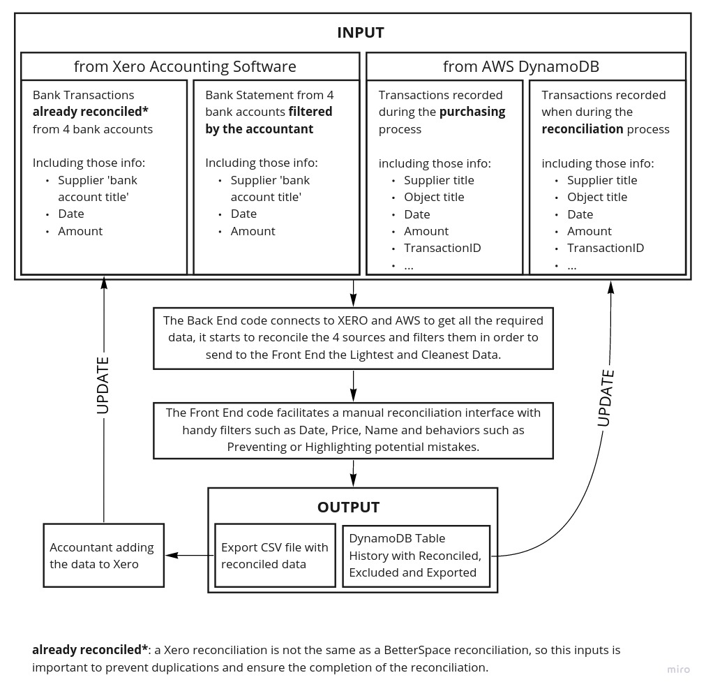
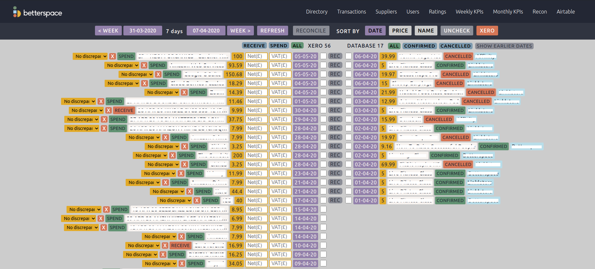
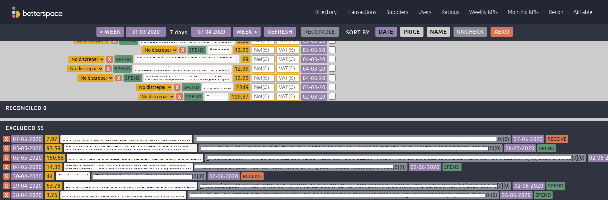
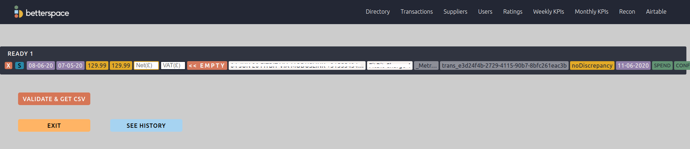
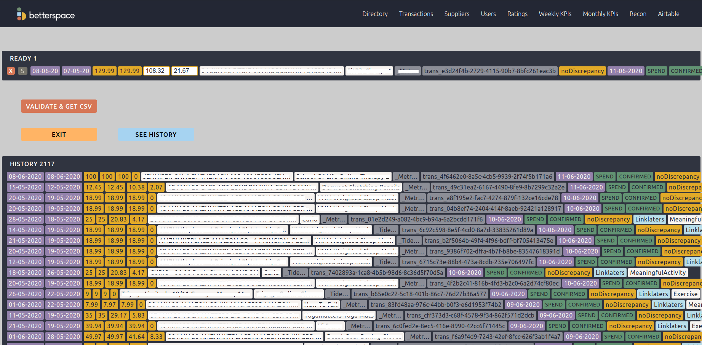

# Reconciliation

This is a presentation of a tool I created for the purpose of reconciling transactional data between our DynamoDB and Xero.

## The problem

The company needs to track transactions for accounting purposes.

- When a purchase is done for the company, a transaction is added in the Bank Statement, and can be seen in Xero, the accounting software.
- When a purchase is done for a client through the company, the transaction is also created in the database DynamoDB.

It is necessary to know what the Bank Statement Transactions correspond to (the type of product, service…), however the Bank Statement Transaction only has those information: Supplier Title, Transaction Date and Transaction Amount.

So, every Bank Statement Transaction needs to be reconciled with its corresponding DynamoDB Transactions which has all data to determine what it is. This process was done manually with the CSV file extracted from Xero and the CSV file extracted from DynamoDB, it was too long for the admins and accountants.

## The stakeholders

This process of developping this tool required the involvement of those stakeholders:

- The Accountant, understand their needs
- The Admins, understand how they process the reconciliation manually and what can facilitate their work.
- The Frontend developer to further understand how Admins use the interfaces and the React / Redux architecture.
- The Backend developer to further understand the Database and API architecture and how it may evolve.
- The CTO, to confirm the plan and implementationg of the MVP.

## The requirements - User stories

As an Admin responding to the Accountancy requirements:

- So I can visualise transactions from the Bank on Xero and from BetterSpace Database I need to:

  - Read the Xero Transaction Data ( Date, Price, Name)
  - Read the Database Transaction Data ( Date, Price, Name, Invoice)

- So I can get data from a specific period I need to:

  - Select a date range from a calendar

- So I can easily see the matching data I need to:

  - Read sorted data side by side (Date, DateReverse, Price, PriceReverse, Name, NameReverse)

- So I can reconcile transactions, I need to:

  - Reconcile a Xero and a Database Transactions
  - See the reconciled transactions
  - Unreconcile them if necessary
  - (Reconcile means adding a transactionId to the BankXeroTransaction)

- So I can quickly reconcile transactions, I need to:

  - Have a keyboard shortcut (space)
  - Having a reconcile shortcut if the 2 matching transactions face each other

- So I can remove the unwanted transactions from Xero, I need to:

  - Exclude Xero Transactions
  - See the list of excluded transactions
  - Cancel the exclusin if necessary

- So I do not worry if I close my window, I need to:

  - Have my actions saved automatically

- So I can double check my reconciliation before giving it to the accountant, I need to:

  - See a dedicated screen highlighting potential errors
  - Being able to unreconcile transaction, so they will not be validated and exported

- So I see what has been given to the accountant in the past, I need to:

  - Access to the history

- So I can have a record of when action have been done, I need:

  - A timestamp for Excluded, Reconciled and Saved tables

- So I can manage Refunded transaction, I need to:

  - See RECEIVE or SPEND transactions from Xero
  - See CANCELLED or CONFIRMED transactions from the database
    filter them

- So I can manage when 1 Xero transaction matches the addition of 2 Database transactions, I need to:

  - Select multiple Database transactions

- So I can manage Discrepancies, I need to:

  - Add Net and VAT manually if needed
  - Select a specific kind of discrepancy
  - Be helped to see discrepancy

- So I can give reconciled data to the accountant, I need to:
  - Export the reconciled data to a CSV file

## Diagrams

Here is a big picture diagram of the tool.

## Screenshots

Page 1 - Seeing the unreconciled transactions according to a selected duration, filtering them if necessary and reconciling them when relevant.

Page 1 - Seeing the reconciled and excluded transactions according to the selected duration, adding them back to unreconciled transactions if necessary.

Page 2 - Seeing the all the reconciled transactions ready to be Validated and Exported, and making modifications if necessary.

Page 2 - Seeing the history of all transactions Validated and Exported.

